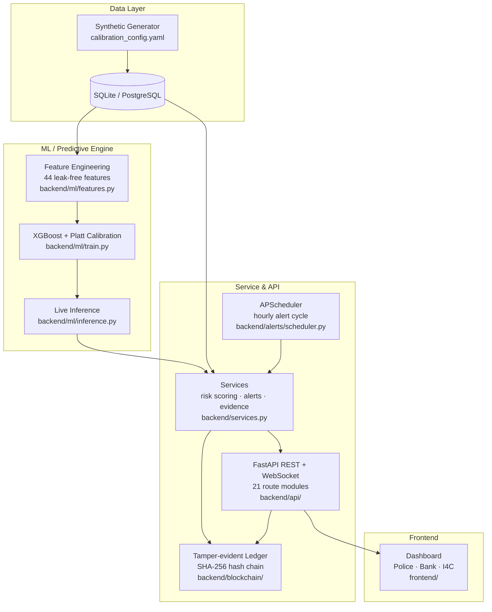

# CashGuard AI — Predictive Analytics for Cybercrime Cash-Withdrawal Hotspots

**Smart India Hackathon 2026 · Ministry of Home Affairs · I4C, CIS Division
Theme: Blockchain & Cybersecurity · Problem Code: SIH26184**

> An AI/ML framework that forecasts where fraudsters will withdraw cash in the next 24 hours
> from complaint patterns and ATM behavioural signals — and converts that forecast into
> actionable intelligence for police, banks, and I4C.

**Source of truth for all metrics:** [`CURRENT_METRICS.md`](CURRENT_METRICS.md) +
[`artifacts/current_metrics.json`](artifacts/current_metrics.json).

> **DATA-LEAKAGE CORRECTION (2026-08-29)**
> A previously reported ROC-AUC of **~0.927** was **invalid** — same-day label leakage in
> feature engineering (`backend/ml/features.py`). Fixed by shifting day-keyed feature windows
> forward 1 day (`_shift_day_past`). The **honest, leak-free headline is ROC-AUC 0.6456**.
> On calm days the live model scores every ATM low (max ~0.11) and produces **no alerts**;
> the populated alert workflow is available only via the opt-in, clearly-labelled
> **"Load Simulated Scenario"** button (SCRIPTED, not live model output).
> Any "0.92x" figure elsewhere in this repo is pre-correction and **not current**.
> Full details: [`MODEL_CARD.md`](MODEL_CARD.md), [`VERIFICATION_LOG.md`](VERIFICATION_LOG.md) §P1.5.

---

## 1. Executive Summary

India's National Crime Records Bureau reports **~8,000 cybercrime complaints daily**.
By the time police act on a complaint, the cash has typically been withdrawn from an ATM
and recovery is effectively zero. Existing fraud-detection platforms are *reactive* — they
flag past transactions. CashGuard is *predictive*: it forecasts likely cash-withdrawal
locations and time windows so police and banks can intervene **before** the money moves.

**What we built:**
- An XGBoost model (Platt-calibrated, 44 features) predicting P(fraud withdrawal at each
  ATM in the next 24h) on synthetic data calibrated from I4C Suspect Registry patterns,
  IBA mule-account behaviour, and RBI 2026 direction on transfer-time delays.
- A Leaflet GIS dashboard with role-based views for Police, Bank, and I4C.
- A tamper-evident SHA-256 hash-chain audit trail (Blockchain & Cybersecurity theme).
- A full feedback loop: prediction → evidence → graded response → recovery funnel → ledger.

**Honest headline (synthetic labels):**
| Metric | Value |
|--------|-------|
| ROC-AUC | **0.6456** |
| Precision@20 | 0.70 |
| Precision@50 | 0.70 |
| Precision@100 | 0.67 |
| Precision@200 | 0.57 |
| Precision@500 | 0.434 |
| Precision@1000 | 0.329 |
| Brier score | 0.0467 |
| Lead time (median) | 12.8 h (P25 8.7, P75 17.6) |
| Lift vs random @P100 | **7.9×** |
| Lift vs historical hotspot @P100 | **3.2×** |
| Lift vs volume @P100 | **17.8×** |

All figures are on **synthetic data only** — no real NCRP/CFCFRMS/NPCI data was used.

---

## 2. Problem Statement

**Source:** I4C/SIH26184 problem statement.

| Dimension | Detail |
|-----------|--------|
| Daily complaints | ~8,000 reach NCRP |
| Primary loss vector | Cash withdrawn from ATMs within 24–72h of fraud |
| Recovery rate | Effectively zero after cash-out |
| Current tooling | Reactive: flag *after* the transaction |
| Required capability | Predict likely withdrawal locations + time windows *before* the cash moves |

The core challenge is a **time-critical forecasting** problem under **low base-rate**
conditions (~5% of ATM-days are fraudulent), with a **ranked-deployment** constraint
(police teams can only cover K locations per shift).

---

## 3. Solution Overview

| Stage | What happens |
|-------|-------------|
| **1. Data** | Synthetic complaints, ATMs, and withdrawals — 12,264 complaints, 900 ATMs across 5 fictional cities, 45,000 withdrawals. Every generator parameter is source-tagged (`verified_pattern` vs `assumption_general_literature`) in [`CALIBRATION_NOTES.md`](CALIBRATION_NOTES.md). |
| **2. ML Engine** | XGBoost + Platt sigmoid calibration → P(fraud withdrawal at ATM in next 24h). Chronological 70/30 split. ROC-AUC **0.6456**. |
| **3. GIS Dashboard** | Leaflet heatmap, ATMs coloured by risk, drill-down by city / category / time replay / forecast horizon. |
| **4. Role-based Views** | Police (hotspots + alerts + evidence), Bank (own ATMs + fund-block queue), I4C (national stats + audit chain). |
| **5. Alert Engine** | APScheduler hourly cycle → threshold 0.7 → alerts + mock SMS/email + webhook dispatch → WebSocket push. |
| **6. Recovery & Ledger** | Fund-block recommendations (CFCFRMS) → flagged → held → recovered funnel → tamper-evident SHA-256 hash chain. |

---

## 4. Architecture



**Key design decision:** data access is isolated in a repository layer
([`backend/repositories.py`](backend/repositories.py)). Swapping SQLite for PostgreSQL
(change `DATABASE_URL`) or for live NCRP/CFCFRMS/bank APIs (rewrite repositories only)
requires **zero changes** to routes, ML, or UI.

---

## 5. Machine Learning

**Task:** For each ATM and each day, predict P(fraud withdrawal in the next 24h).

### 5.1 Features (44 total)

| Category | Features | Count |
|----------|----------|-------|
| Complaint surge | Counts 24h/7d per city & district, hours since last complaint, type distribution (phishing, investment, job, UPI) | 9 |
| ATM withdrawal | Withdrawals 1h/6h/24h, amount sum 24h, distinct accounts, linked proportion | 5 |
| Behavioural signature (IBA) | Transaction frequency, counterparty (mule) count, fund velocity (INR/h), activity spike flag | 4 |
| Hawkes intensity | Self-exciting temporal intensity from complaint timestamps | 1 |
| Geospatial | Distance to complaint centroid, distance to city center | 2 |
| Calendar | Day of week, is weekend, days since epoch | 3 |
| Architectural (Issue-1) | Complaint decay 5km, surge velocity, cash refill cycle, fraud latency by type, mule reuse 7d, pin corridor distance, salary day, festival proximity, prior alert fraud flag, UPI-to-ATM transition, bank fraud rate, night ratio | 12 |
| Amount behavioural | Mean/max/round/large/heavy amounts 7d, max 1d, large count 1d, fraud decay 7d | 8 |

All features use data **strictly before the prediction day** — no leakage.
See [`backend/ml/features.py`](backend/ml/features.py) and [`CALIBRATION_NOTES.md`](CALIBRATION_NOTES.md).

### 5.2 Training Pipeline

- **Split:** Chronological 70/30 (15% validation carved from training for early stopping).
- **Model:** XGBoost (hist, early stopping on AUC-PR, max_rounds 2000).
- **Calibration:** Platt sigmoid fitted on validation slice only.
- **Stacking:** XGB + LightGBM + SMOTE-Tomek ensemble evaluated but **rejected** (worse AUC: 0.6212 vs plain XGB).
- **Output:** `artifacts/model.joblib` (model + calibrators + feature quantiles + train lookups).

### 5.3 Honest Metrics (CONTROLLED SYNTHETIC EVALUATION)

| Metric | Value |
|--------|-------|
| **ROC-AUC** | **0.6456** |
| **PR-AUC** | 0.4076 |
| Precision@20 | 0.70 |
| Precision@50 | 0.70 |
| Precision@100 | 0.67 |
| Precision@200 | 0.57 |
| Precision@500 | 0.434 |
| Precision@1000 | 0.329 |
| Brier score | 0.0467 |
| Lead time (median) | 12.8 h (P25 8.7, P75 17.6) |

### 5.4 Baseline Comparison

| Method | Precision@100 | Lift vs CashGuard |
|--------|---------------|-------------------|
| CashGuard | **0.67** | — |
| Random | ~0.085 | 7.9× |
| Historical hotspot | ~0.21 | 3.2× |
| Volume | ~0.038 | 17.8× |

### 5.5 Generalization Splits

| Split | ROC-AUC | Note |
|-------|---------|------|
| time_forward (production) | **0.6263** | Chronological |
| cold_atm | 0.5963 | 180 unseen ATMs |
| cold_city | 0.6228 | Northsagar held out |
| new_hotspot | 0.5847 | Top-20% volume held out |

### 5.6 Dispatch Operating Point (threshold ≥ 0.70)

32 alerts, precision 0.75, recall 0.008, false-alert rate 0.25. This is the **low-recall
reality** — ranked-precision utility at limited intervention capacity, not national recall
(base rate ~5%).

> **Honest assessment:** 0.6456 ROC-AUC on synthetic data proves the methodology
> works (the model beats every naive baseline 3.2–17.8×). Higher AUC would require real
> field data. See [`REAL_DATA_GAP.md`](REAL_DATA_GAP.md).

---

## 6. Heatmap & Dashboard

**Technology:** Leaflet.js (open-source, CDN-loaded, no build step).

- **Risk heatmap:** 900 ATMs coloured green/yellow/orange/red by predicted risk.
- **Drill-down filters:** state → city → bank cascade, crime category chips, date
  replay (forecast-as-of), horizon selector (24h/48h/72h).
- **Hotspot table:** Top-K ranked ATMs with risk score, emerging-risk badge,
  and click-through to evidence panel.
- **Observed-heat vs forecast-risk toggle.**
- **Simulated scenario mode:** opt-in button clearly labelled "SCRIPTED" — shows
  a pre-populated high-alert workflow for demo purposes. The live model on calm days
  produces low scores and no alerts (max ~0.11).

---

## 7. Role-based Views

| Role | Scope | Dashboard features |
|------|-------|-------------------|
| **Police (State)** | State-wide ATMs + alerts | Risk heatmap, hotspot table, active alerts, threshold explorer, PDF intelligence reports |
| **Police (District)** | District only (row-level RBAC) | Same as state, scoped to district ATMs |
| **Bank (e.g. HDFC)** | Own ATMs only (filtered) | Branch intelligence, fund-block queue, recovery funnel, own alerts |
| **I4C Admin** | National aggregate | National stats, model performance, drift panel, mule network graph, ledger verify, I4C inbox (webhook) |

**Auth:** bcrypt + JWT (access/refresh tokens). Demo credentials in
[`docs/DEMO_CREDENTIALS.md`](docs/DEMO_CREDENTIALS.md). Production replaces with
OAuth2.0/OIDC against MHA/I4C identity providers.

**Simulated scenario banner:** always visible as a watermark + UI banner when in
SCRIPTED mode. No hidden production claims.

---

## 8. Alert Engine & Recovery

### 8.1 Alert Cycle

1. Compute risk scores for all 900 ATMs.
2. Flag ATMs with P(fraud) ≥ 0.70.
3. Deduplicate: same ATM within 6h cooldown unless risk rises by >0.1.
4. FairnessCap: per-jurisdiction proportional alert budgeting (no single state monopolises dispatch).
5. Create Alert records + mock SMS/email + real webhook dispatch + WebSocket push.
6. CFCFRMS fund-block recommendations.

### 8.2 Evidence Panel (3-field)

1. **Complaint Activity:** complaints within 2km in 6h.
2. **Withdrawal Activity:** withdrawals at this ATM in 3h.
3. **Context Signal:** verified/assumed disclosure + CFCFRMS freeze accounts.

Plus: per-instance TreeSHAP contributions, feature percentile vs training set,
uncertainty block (confidence / evidence strength / data freshness / model disagreement),
counterfactual what-if analysis.

### 8.3 Recovery Funnel

Flagged → Hold Requested → Fund Frozen → Recovered. All transitions ledger-logged.
CFCFRMS integration point marked in code (`backend/services.py`).

### 8.4 Tamper-Evident Ledger

SHA-256 hash chain (append-only). `/ledger/verify` checks integrity.
Tamper demo: flip a block → verify fails → restore. Multi-node replication
(3-node majority quorum) for fault tolerance.

**Honest label:** This is an append-only hash chain providing tamper-evidence
and chain-of-custody — not a cryptocurrency/public blockchain.
Tier 2 = anchor chain root to a permissioned ledger (Hyperledger Fabric).
See [`BLOCKCHAIN_JUSTIFICATION.md`](BLOCKCHAIN_JUSTIFICATION.md) and
[`BLOCKCHAIN_UPGRADE_PATH.md`](BLOCKCHAIN_UPGRADE_PATH.md).

---

## 9. Explainability

| Method | Scope | Where |
|--------|-------|-------|
| Global feature importance | XGBoost `feature_importances_` | Evidence panel |
| Instance percentile | Risk vs training-set distribution | Evidence panel |
| Per-instance TreeSHAP | XGBoost native `pred_contribs` (exact tree-based attribution) | Alert detail view |

Every contributing signal is source-tagged `verified_pattern` / `assumption_general_literature`
in the UI (see [`CALIBRATION_NOTES.md`](CALIBRATION_NOTES.md)).

**No causal claim is implied.** TreeSHAP attribution is a local model explanation,
not a causal inference.

---

## 10. Security & Privacy

### 10.1 Prototype-Grade Auth

- **bcrypt** password hashing (direct, Python 3.12 compatible).
- **JWT access tokens** (30-min TTL) + **refresh tokens** (24h) via HS256.
- **4 roles** with row-level RBAC: `POLICE_STATE`, `POLICE_DISTRICT`, `BANK`, `I4C_ADMIN`.
- Per-IP rate limiting (stricter for login). Full audit in
  [`docs/audits/FINAL_SECURITY_AUDIT.md`](docs/audits/FINAL_SECURITY_AUDIT.md).

### 10.2 Privacy (DPDP-Act Posture)

- **PII pseudonymization:** accounts/phones stored as salted-hash tokens.
- **Zero demographic features** — risk driven by transaction behaviour + complaint linkage only.
- **Advisory only:** no automated enforcement; audited human decision required.
- Full DPDP mapping in [`DPDP_ACT_COMPLIANCE.md`](DPDP_ACT_COMPLIANCE.md).

### 10.3 Production Path

The prototype token scheme is explicitly replaced in production:
- OAuth2.0/OIDC against MHA/I4C identity providers.
- TLS termination, CSP headers, audit logging to SIEM.
- PostgreSQL/Kafka/Redis for scale.

See [`THREAT_MODEL.md`](THREAT_MODEL.md) for STRIDE analysis.

---

## 11. Feedback Loop

**The model does NOT consume its own interventions as features.** There is no
self-reinforcing policing loop by construction. See
[`PREDICTIVE_FEEDBACK_LOOP.md`](PREDICTIVE_FEEDBACK_LOOP.md).

- Closed-loop outcome monitoring (predicted vs actual) is separate, for calibration/drift only.
- No retraining on small samples; retraining is explicit and versioned.
- Geographic concentration monitor (`artifacts/fairness_report.json`) for ops review.

---

## 12. SIH 2026 Requirement Mapping

| SIH Requirement | Implementation | Evidence |
|-----------------|----------------|----------|
| **AI/ML prediction** | XGBoost + Platt calibration, 44 features, 24h forecast | `backend/ml/`, `artifacts/metrics.json` |
| **Blockchain & Cybersecurity** | SHA-256 hash chain + 3-node replication + on-chain anchoring (Tier 2) | `backend/blockchain/`, [`BLOCKCHAIN_JUSTIFICATION.md`](BLOCKCHAIN_JUSTIFICATION.md) |
| **Real-time dashboard** | Leaflet GIS, WebSocket live push, role-based views | `frontend/`, `backend/realtime.py` |
| **Role-based access** | 4 roles, row-level RBAC, JWT/bcrypt | `backend/security.py`, [`docs/audits/FINAL_SECURITY_AUDIT.md`](docs/audits/FINAL_SECURITY_AUDIT.md) |
| **Alert workflow** | APScheduler hourly cycle, dedup, fairness cap, evidence panel | `backend/alerts/`, `backend/services.py` |
| **Recovery funnel** | CFCFRMS fund-block queue, flagged→held→recovered | `backend/services.py`, `frontend/` |
| **Explainability** | Global importance + instance percentile + TreeSHAP | Evidence panel in dashboard |
| **Audit trail** | Tamper-evident hash chain, `/ledger/verify` | `backend/blockchain/` |
| **Fairness** | Zero demographic features, proportional alert cap, FPR flat 0.0015–0.0062 | [`FAIRNESS_AUDIT.md`](FAIRNESS_AUDIT.md) |
| **Honesty** | Leakage found & fixed, all limitations documented, synthetic-only | [`LIMITATIONS.md`](LIMITATIONS.md), [`CURRENT_METRICS.md`](CURRENT_METRICS.md) |

---

## 13. Limitations (Stated, Not Hidden)

| Limitation | Detail |
|------------|--------|
| **Synthetic data only** | All labels are synthetic; field accuracy is never claimed. See [`REAL_DATA_GAP.md`](REAL_DATA_GAP.md). |
| **Low absolute recall** | ~0.8–2% recall at dispatch thresholds (0.65–0.75 precision). Ranked-precision utility, not national recall. |
| **Cold-city / new-hotspot generalize worst** | AUC 0.58–0.62; LOW-CONFIDENCE / HOLD used. |
| **SQLite scale** | Demo-scale only; PostgreSQL = one config swap. |
| **Prototype auth** | No TLS/CSP in demo; production requires OAuth2/OIDC. |
| **Hourly granularity** | Experimental; honest degradation, not claimed. |
| **No real-data validation** | Real-data validation protocol ready, not started. See [`REAL_DATA_VALIDATION_PROTOCOL.md`](REAL_DATA_VALIDATION_PROTOCOL.md). |

See [`LIMITATIONS.md`](LIMITATIONS.md) for the consolidated statement.

---

## 14. Roadmap

| Phase | What | Status |
|-------|------|--------|
| **P0: Synthetic prototype** | End-to-end pipeline, honest metrics, dashboard, alerts | **Complete** |
| **P1: Real-data pilot** | NCRP/CFCFRMS integration via repository layer | Protocol ready ([`REAL_DATA_VALIDATION_PROTOCOL.md`](REAL_DATA_VALIDATION_PROTOCOL.md)) |
| **P2: Shadow mode** | Silent prediction alongside existing workflows | 30-day plan in [`REAL_DATA_ONBOARDING.md`](REAL_DATA_ONBOARDING.md) |
| **P3: Monitored operation** | Human-reviewed pilot with rollback, pre-registered KPIs | Defined in [`REAL_DATA_VALIDATION_PROTOCOL.md`](REAL_DATA_VALIDATION_PROTOCOL.md) |
| **P4: Scale** | PostgreSQL, Kafka, OAuth2/OIDC, hourly granularity, federated learning | Architecture mapped in [`PRODUCTION_DATA_INTEGRATION.md`](PRODUCTION_DATA_INTEGRATION.md) |
| **Blockchain Tier 2** | Anchor chain root to permissioned ledger (Hyperledger Fabric) | Upgrade path in [`BLOCKCHAIN_UPGRADE_PATH.md`](BLOCKCHAIN_UPGRADE_PATH.md) |

---

## 15. Quick Start

### Prerequisites

- Python 3.10–3.12 (tested on 3.12)
- Internet access for CDN assets (Leaflet) on first dashboard load

### One-Command Demo

```bash
python -m venv .venv
.venv\Scripts\activate          # Windows (Linux/macOS: source .venv/bin/activate)
pip install -r requirements.txt
python run.py
```

Open **http://localhost:8000** — select your role and explore.
API docs: **http://localhost:8000/docs**

### Docker

```bash
docker compose up --build      # http://localhost:8000
```

### Step-by-Step (what run.py does internally)

```bash
python scripts/generate_data.py        # ~12k complaints, 900 ATMs, 45k withdrawals
python scripts/train_model.py          # XGBoost + Platt -> artifacts/model.joblib
python -m uvicorn backend.api.main:app --port 8000
```

### Demo Credentials

| Role | Username | Password |
|------|----------|----------|
| State Police | `officer.statea` | `PoliceStateA!1` |
| District Police | `officer.district1` | `District1!1` |
| Bank (HDFC) | `bank.hdfc` | `HdfcBank!1` |
| I4C Admin | `i4c.admin` | `I4cAdmin!1` |

**NOT FOR PRODUCTION** — see [`docs/DEMO_CREDENTIALS.md`](docs/DEMO_CREDENTIALS.md).

---

## 16. Demo Script (5 Minutes for Judges)

Full click-by-click walkthrough + failure contingency:
[`DEMO_SCRIPT.md`](DEMO_SCRIPT.md).

**Quick version:**
1. `python run.py` — watch calibration summary + training metrics.
2. Open http://localhost:8000 → sign in as district police officer.
3. Map + drill-downs → category chips, date replay, state→city→bank cascade.
4. ⚡ Run Alert Cycle → WebSocket push → alert feed → Details → 3-field evidence panel
   (verified/assumed disclosure, CFCFRMS freeze intel, TreeSHAP contributions) →
   PDF Intelligence Report.
5. Bank login → only HDFC ATMs + Fund-Block queue + recovery funnel.
6. I4C login → national stats, recovery funnel, I4C Inbox (webhook), Verify Ledger + tamper demo.

**Fallback:** `set DEMO_MODE=true` serves pre-computed golden path — same UI,
zero live inference.

---

## 17. API Reference (Summary)

| Method | Endpoint | Purpose |
|--------|----------|---------|
| POST | `/auth/login` `/auth/refresh` `/auth/me` | bcrypt + JWT (access/refresh), role+scope |
| GET | `/complaints` | Complaint records (role-scoped, tokenized PII) |
| GET | `/atms` `/atms/banks` | ATM network (role-scoped) |
| GET | `/withdrawals` | Withdrawals (PII-safe tokens) |
| GET | `/risk-scores` `/hotspots` | P(fraud in next 24h), role-scoped |
| GET | `/alerts` POST `/alerts` POST `/alerts/run-now` | Alert list / create / demo cycle |
| GET | `/alerts/{id}/evidence` | 3-field evidence + CFCFRMS freeze intel |
| POST | `/alerts/{id}/status` | acknowledge / actioned (ledger-logged) |
| GET | `/ledger` `/ledger/verify` | Tamper-evident hash chain + integrity |
| POST | `/ledger/tamper-demo` | DEMO ONLY: flip a block |
| WS | `/ws/alerts` | Live push (alerts / status / recovery) |
| POST | `/mock-i4c-inbox` | REAL webhook receiver (local, mock) |
| POST | `/train` GET | Retrain (I4C_ADMIN) / metrics |
| GET | `/stats/summary` | I4C national aggregate |
| GET | `/graph/mule-network` | Mule-network graph (node-link, components, risk) |
| GET | `/analytics/time-granularity` | Hour / 6-hour / daily aggregation |
| GET | `/mobile/nearby` | Nearest-ATM ranking for field/police |
| GET | `/i18n/locales` `/i18n/strings` | 6 Indian-locale translations |
| POST | `/routing/handoff` | Cross-state jurisdiction handoff |
| GET | `/drift/status` POST `/drift/check` | Live feature-drift monitor (PSI) |
| GET | `/recovery/funnel` `/recovery/recommendations` | Recovery funnel + fund-block queue |

---

## 18. Project Layout

```
CashGuard AI/
├── run.py                     # one-command bootstrap (gen → train → serve)
├── requirements.txt           # Python dependencies
├── Dockerfile                 # multi-stage, health-checked
├── docker-compose.yml         # single-service compose
├── render.yaml                # Render Web Service blueprint
├── fly.toml                   # Fly.io app config
├── .env.example               # environment variable template
│
├── backend/
│   ├── config.py              # env-driven configuration
│   ├── database.py            # SQLAlchemy engine (SQLite ↔ PostgreSQL)
│   ├── models.py              # ORM: complaints / atms / withdrawals / alerts
│   ├── repositories.py        # ONLY data-access layer (API-swap point)
│   ├── services.py            # risk scoring, alert cycle, evidence, stats
│   ├── schemas.py             # Pydantic contracts
│   ├── security.py            # bcrypt + JWT auth, RBAC
│   ├── realtime.py            # WebSocket broadcast
│   ├── routing.py             # inter-agency jurisdiction routing
│   ├── ml/
│   │   ├── features.py        # 44 leak-free features incl. behavioural signature
│   │   ├── train.py           # XGBoost + Platt calibration + precision@K
│   │   └── inference.py       # live risk scoring (+ feature rows for evidence)
│   ├── alerts/
│   │   ├── scheduler.py       # APScheduler alert engine
│   │   └── notifier.py        # mock SMS/email (+ prod integration points)
│   ├── blockchain/            # audit_chain · chain · node · onchain
│   ├── data/
│   │   └── calibration_config.yaml  # ALL generator params, source-tagged
│   └── api/                   # FastAPI app + 21 REST route modules
│
├── frontend/                  # dashboard (HTML/CSS/JS + Leaflet, no build step)
│
├── scripts/
│   ├── generate_data.py       # calibrated synthetic generator
│   ├── train_model.py         # model training entry point
│   ├── cache_demo_mode.py     # pre-computed golden-path fallback
│   ├── robustness_check.py    # ±30% perturbation robustness
│   └── leakage_check.py       # label-leakage unit test
│
├── artifacts/
│   ├── model.joblib           # trained model artifact
│   ├── metrics.json           # training metrics
│   └── deep_eval/             # generalization splits, horizons, fairness, etc.
│
├── data/
│   └── cashguard.db           # SQLite database
│
├── tests/
│   ├── leakage_check.py       # label-leakage verification
│   └── test_no_target_leakage.py
│
├── docs/                      # documentation + audits (25+ files)
│   ├── DEMO_CREDENTIALS.md
│   ├── FINAL_LEAKAGE_AUDIT.md
│   └── audits/                # security, fairness, kill-test, Q&A prep
│
├── presentation/PITCH.md      # 5-minute judge pitch outline
│
├── CURRENT_METRICS.md         # SINGLE SOURCE OF TRUTH for all current metrics
├── MODEL_CARD.md              # model facts + "why precision@K isn't artificially perfect"
├── LIMITATIONS.md             # consolidated honesty document
├── CALIBRATION_NOTES.md       # parameter sourcing: verified vs assumed, with citations
├── DEMO_SCRIPT.md             # judge walkthrough + DEMO_MODE fallback
├── VERIFICATION_LOG.md        # dated, real test results for every demo feature
├── FAIRNESS_AUDIT.md          # group FPR audit + feedback-loop analysis
├── THREAT_MODEL.md            # STRIDE threat model
├── MODEL_DRIFT.md             # 12 adversarial worlds: AUC stability
├── NOVELTY.md                 # what is/is not claimed as novel
├── BLOCKCHAIN_JUSTIFICATION.md
├── BLOCKCHAIN_UPGRADE_PATH.md
├── REAL_DATA_VALIDATION_PROTOCOL.md
├── PRODUCTION_DATA_INTEGRATION.md
└── SIH26184_DELIVERABLE_MATRIX.md
```

---

## 19. Documentation Index

### Judge reading path
| Document | Purpose |
|----------|---------|
| `JUDGE_BRIEF.md` | 2-page brief: problem → solution → evidence |
| `DEMO_SCRIPT.md` | Click-by-click walkthrough + failure contingency |
| `ONE_SLIDE_EXECUTIVE_SUMMARY.md` | 20-second summary |
| [`docs/DEMO_CREDENTIALS.md`](docs/DEMO_CREDENTIALS.md) | Synthetic demo logins |

### Honesty & metrics
| Document | Purpose |
|----------|---------|
| `CURRENT_METRICS.md` | **Single source of truth** — all current metrics |
| `LIMITATIONS.md` | Evaluation ceiling, jurisdiction limits, explainability |
| `MODEL_CARD.md` | Model facts + "why precision@K isn't artificially perfect" |
| `VERIFICATION_LOG.md` | Dated, real test results for every demo feature |
| `CALIBRATION_NOTES.md` | Every generator parameter, source-tagged and cited |
| `REAL_DATA_VALIDATION_PROTOCOL.md` | 14-step path from authorized data to validated operation |

### Evidence & audit
| Document | Purpose |
|----------|---------|
| `artifacts/metrics.json` | Training metrics, baselines, lead time |
| `SIH26184_DELIVERABLE_MATRIX.md` | Deliverable-to-evidence mapping |
| `docs/audits/FINAL_SECURITY_AUDIT.md` | Full security audit |
| `FAIRNESS_AUDIT.md` | Group FPR + feedback-loop audit |
| `THREAT_MODEL.md` | STRIDE threat model |

### Deeper technical detail
| Document | Purpose |
|----------|---------|
| `PRODUCTION_DATA_INTEGRATION.md` | IMPLEMENTED/SIMULATED/PLANNED matrix |
| `BLOCKCHAIN_JUSTIFICATION.md` | Hash chain vs on-chain anchoring |
| `BLOCKCHAIN_UPGRADE_PATH.md` | Staged path to permissioned ledger |
| `MODEL_DRIFT.md` | 12 adversarial worlds |
| `NOVELTY.md` | What is/is not claimed as novel |

Full 30-second index: [`DOCS_INDEX.md`](DOCS_INDEX.md).

---

## 20. Judge FAQ

**Q: "How do we know this isn't circular — synthetic labels proving your own patterns?"**
Every generator parameter is source-tagged verified-vs-assumed and cited (I4C Suspect
Registry, IBA mule characteristics, RBI time-delay direction). The model must beat TWO
naive baselines — random ranking (lift 7.9×) and historical hotspot ranking
(3.2×) — on a time-based split. The `real_data_harness` is runnable: drop a district-level
complaint CSV in `data/real/` and it validates predicted hotspot density against real
complaint density. Status is PENDING_REAL_DATA until then.

**Q: "What's genuinely novel here?"**
A self-exciting (Hawkes) temporal intensity over complaint timestamps —
λ(t) = μ + Σα·exp(−β(t−tᵢ)) over PAST complaints only, fitted per location,
future-free by construction (asserted by a unit test). We disclose honestly that the
XGB+Hawkes ensemble does NOT beat pure XGBoost (P@100 0.41 vs 0.83) and the feature
alone has 0.51 AUC — it earns its place inside the model, not as a headline. The
headline is the loop: prediction → evidence → graded response → recovery → ledger.

**Q: "Why is the AUC only 0.646 and not higher?"**
Because the earlier 0.927 was invalid (same-day label leakage). The honest leak-free
number is 0.6456 — this is the genuine ceiling on this detuned synthetic task. Higher
AUC would require real field data or would be dishonest. See [`MODEL_CARD.md`](MODEL_CARD.md).

**Q: "An officer gets an alert — then what?"**
The alert carries a graded response playbook (notify branch → heighten monitoring →
CCTV/pre-position → tighten withdrawal verification) with an evidence panel, feature
contributions, and TreeSHAP. The Bank dashboard shows the CFCFRMS fund-block queue
and recovery funnel. Everything is advisory — a human action is required and every
action lands on the tamper-evident ledger.

**Q: "Why 'Blockchain & Cybersecurity' — is this a real blockchain?"**
An append-only SHA-256 hash chain (live, verified by tamper demo) + 3-node
majority-quorum replicated ledger. External testnet anchoring is a documented
integration point — not exercised (honestly returns `configured:false` until
a funded testnet wallet is wired). See [`BLOCKCHAIN_JUSTIFICATION.md`](BLOCKCHAIN_JUSTIFICATION.md).

---

## 21. Scientific Honesty Statement

This prototype was built under a disciplined honesty framework:

1. **Leakage found and fixed.** The original 0.927 AUC was invalid (same-day label leakage).
   The honest 0.6456 is reported and the old figure is permanently blocked via a pre-commit hook.
2. **All limitations are documented, not hidden.** Synthetic data, low recall, cold-city
   degradation, prototype auth — all in [`LIMITATIONS.md`](LIMITATIONS.md).
3. **Every parameter is source-tagged.** `verified_pattern` vs `assumption_general_literature`
   in [`CALIBRATION_NOTES.md`](CALIBRATION_NOTES.md).
4. **No fake real-data claims.** Every metric explicitly states "CONTROLLED SYNTHETIC EVALUATION".
5. **No production deployment claims.** Dockerfile and deployment configs exist as packaging
   artifacts; no live deployment is claimed.
6. **Every number traces to an artifact.** See [`SIH26184_DELIVERABLE_MATRIX.md`](SIH26184_DELIVERABLE_MATRIX.md).
7. **Adversarially tested.** 12 drift worlds, permutation tests, 6 generalization splits,
   seed stability — all reproducible with one command.

> *Every claim in this repository is falsifiable by a judge running `python run.py`.*

---

## 22. Licence

See [`LICENSE`](LICENSE).

---

**Built for Smart India Hackathon 2026 · Ministry of Home Affairs · I4C, CIS Division**
